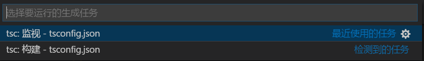
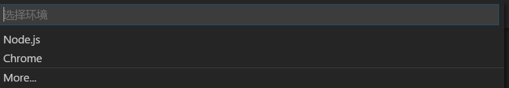
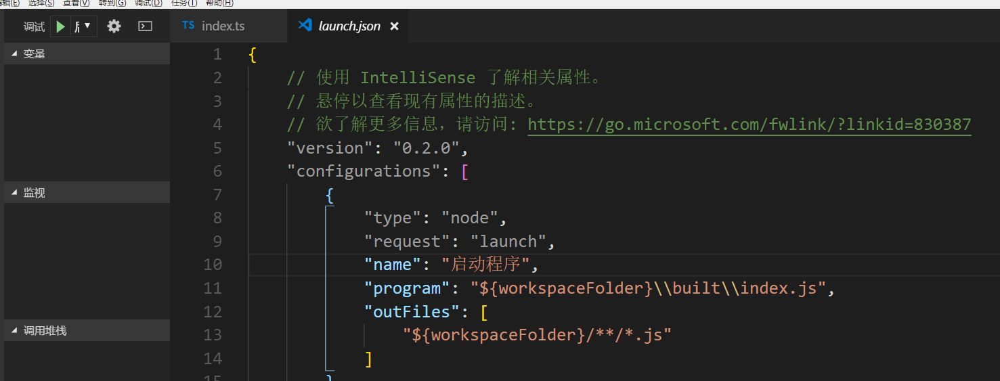

# 简介
VSCode 是微软公司推出的一款开源的文本编辑器，因其强大的功能，较快的启动速度（相比IDE而言）和内置的控制台，git等而广受好评。
而Typescript同样是微软推出的改良版Javascript，其作为JS的超集，完美兼容ES7的语法之外有着更完备的模块系统，更多的特性（装饰器，枚举），以及编译时的静态类型检查，有效避免了“动态一时爽，重构火葬场”的尴尬。

# 准备

- VSCode 

- NPM （包管理工具）

# 步骤
1.  打开命令行，键入`npm i -g typescript` 全局安装TS
2.  继续在命令行环境下键入 `tsc -init`  进行初始化，
你会发现根目录下多了 tsconfig.json 的文件，记录了编译成JS的选项
3.  打开该文件，会发现主要选项已经帮你设置好了，比较常用的设置是
	- "target" : 编译为何种规范，一般设置为 ES5 或者 ES2016/2017
	- “outdir” : 输出目录
  -  "alwaysStrict" ： 打开严格模式 ('use strict')
4.  命令行下输入 `code .` 打开VSCode进入该目录，按下 Ctrl+shift+B 快捷键会进行编译，初次编译会选择编译模式
 
**监视模式 是每当TS文件有变动就会自动编译，构建模式是手动命令编译时才会去编译,这里选择监视模式**

5. 按下F5开始调试，初次调试会让你选择调试环境

**这个根据自己JS的宿主环境进行选择，本文使用NODE环境**
6. 在调试按钮上面有一个配置按钮，点击对调试进行详细修改

# 完工
这样一个基本的TS环境就搭建完毕，按CTRL+shift+b编译，按F5调试，再也不同手敲命令了，是不是很方便呢？